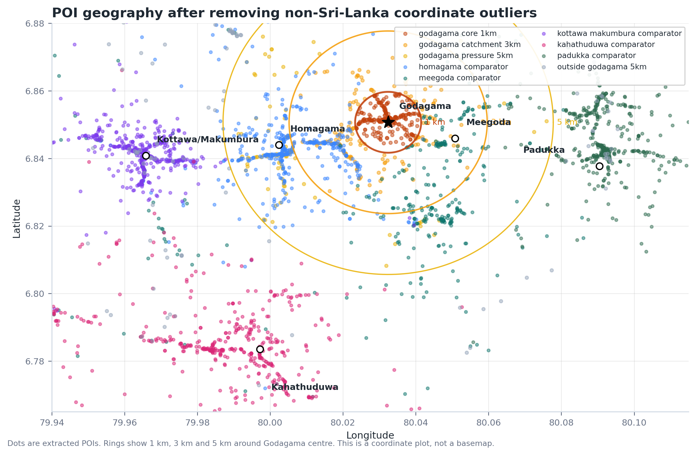
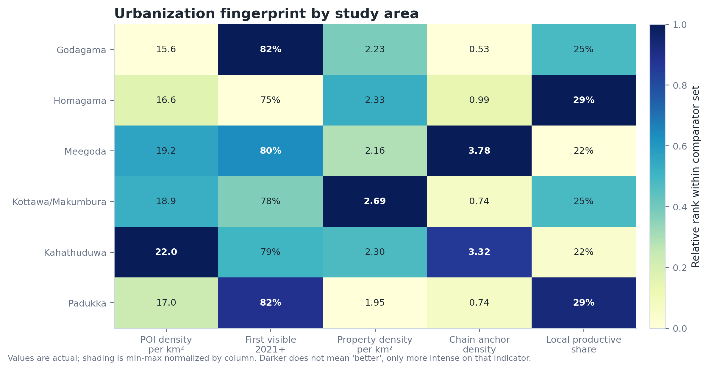
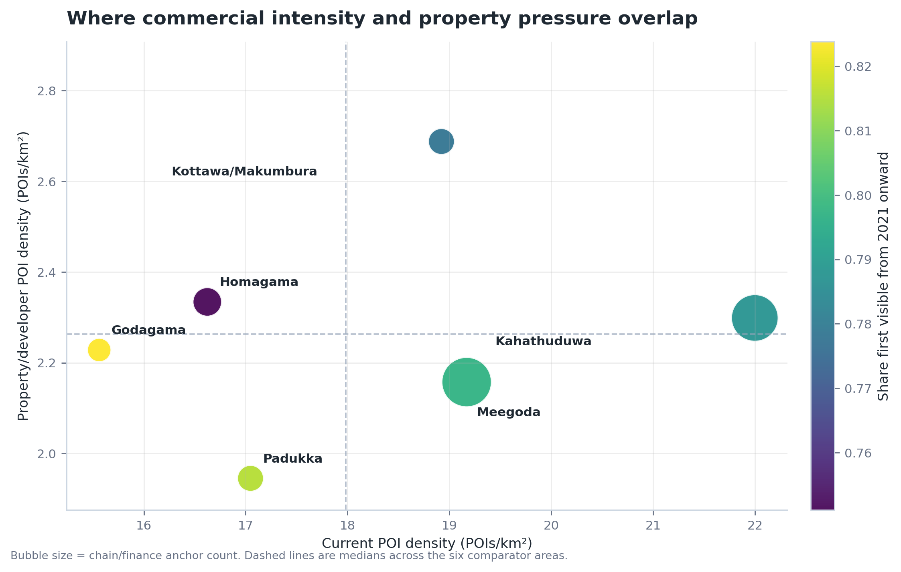
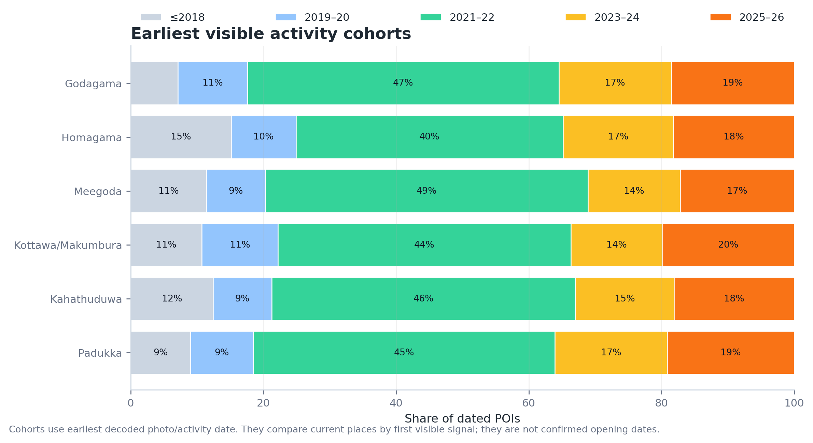
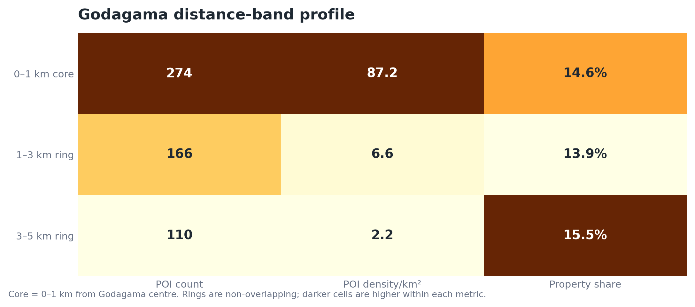
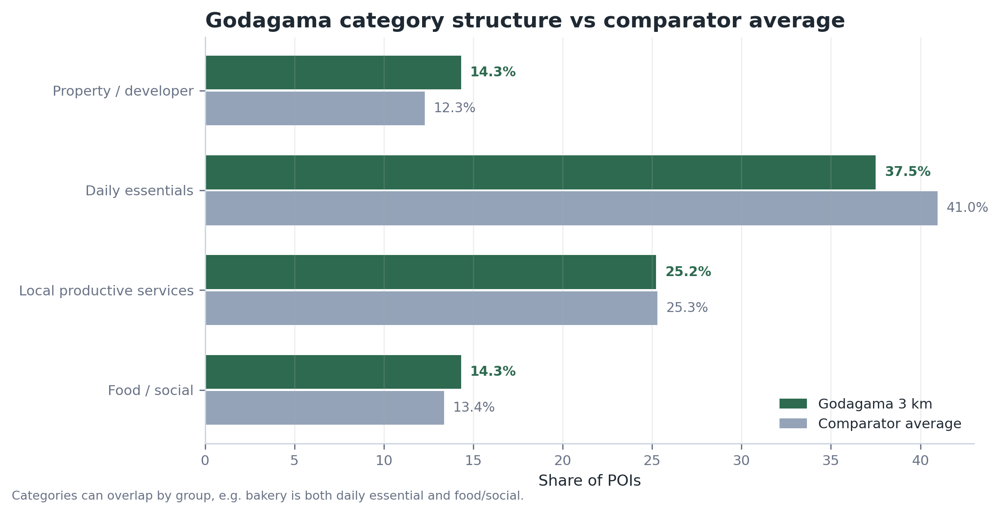
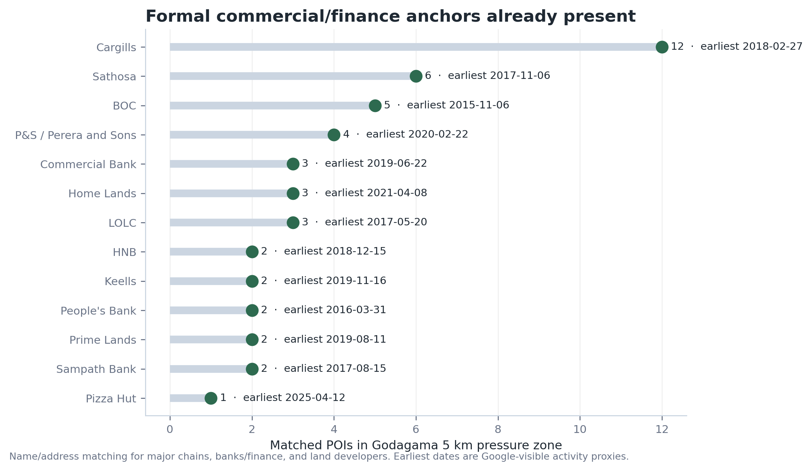
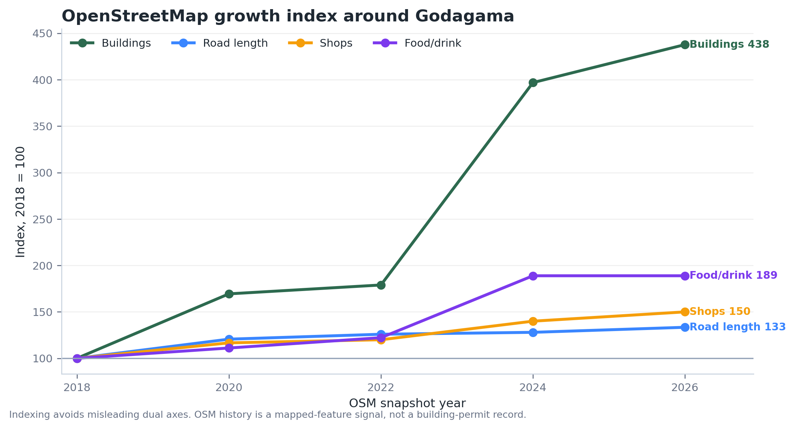

# Urbanization Research — Case Study 01: Godagama 10200

Date: 2026-06-27  
Case-study area: Godagama town, Colombo District, Western Province, Sri Lanka.  
Repository: **Urbanization Research**. Godagama is the first city/town case study.  
Public repo: <https://github.com/minzique/urbanization-research>

## Purpose

This report models early urbanization pressure around Godagama using multiple evidence layers: Google-derived points of interest, OpenStreetMap history, official UDA/RDA planning documents, expressway/interchange context, developer market signals, and identified open datasets for future satellite/census expansion.

The report is data-led. Recommendations are included only where they follow directly from the measured pattern.

## Executive findings

1. **Godagama has a dense core and a thinner surrounding catchment.** The 3 km catchment has **440 extracted POIs** (**15.6/km²**). The 1 km core alone has **274 POIs**, about **87.2/km²**.
2. **The current Godagama POI layer is recent.** **82.4%** of dated Godagama POIs were first visible from **2021 onward**, the highest recent-share among the six comparator areas in this extract.
3. **Property/developer pressure is already visible.** Godagama has **63 property/developer POIs** in the 3 km catchment, **14.3%** of the extracted POI base. That share is close to Homagama and Kottawa/Makumbura.
4. **Comparator pressure is strongest in Kahathuduwa, then Meegoda and Kottawa/Makumbura.** Current score ranking: **Kahathuduwa (72.2), Meegoda (57.6), Kottawa/Makumbura (53.6), Godagama (34.5)**.
5. **OSM history shows physical growth before full commercial maturity.** In the Godagama-area OSM bounding box, mapped buildings rose **+338%** from 2018 to 2026, while mapped road length rose **+33%**.

## Evidence layers used

| Layer | What it contributes | Status in this report | Main limitation |
|---|---|---|---|
| Google-derived POI extract | Current places, category mix, rough first-visible activity dates, chains/anchors | Quantitative: 3,494 geospatially valid POIs after removing one non-Sri-Lanka coordinate outlier | Earliest photo/activity date is not a verified opening date; review count and first review date not decoded yet |
| OpenStreetMap / ohsome history | Mapped buildings, roads, shops, food/drink places over time | Quantitative baseline: 2014–2026 time slices, charted as indexed growth | Affected by mapping completeness and edit bursts |
| UDA Homagama Development Plan | Official zoning, town hierarchy, environmental control zones, guide-plan areas | Integrated as planning evidence: Godagama HD Commercial Zone III; Kahathuduwa HD Commercial Zone II; wetland/paddy controls | Needs GIS polygon extraction for parcel-level analysis |
| RDA / Exway / gazettes | Expressway chronology, active interchanges, official corridor status | Integrated as transport context: OCH, Southern Expressway, Central Expressway comparator nodes | Needs exact GIS alignment/interchange layers in the model |
| Developer market signals | How land developers market highway access and future value | Integrated qualitatively and via Google land-development POIs | Need full land-price/time-series scrape for price model |
| DCS Census Portal / district handbooks | Population, housing, labour, local-authority context | Source identified; not yet numerically integrated | Next pass should export DS/GN-level 2012 vs 2024 fields |
| GHSL / WorldPop / VIIRS | Satellite built-up, settlement growth, night-time economic intensity | Source stack identified for next model expansion | Not yet extracted into the Godagama case-study calculations |

## Study geography

## Urbanization fingerprint

Darker cells show which places are high on each measured indicator; printed values are actual values.

## Pressure model

The score is a triage index, not a land-price forecast. Inputs: 35% POI density, 25% 2021+ first-visible share, 25% property/developer density, and 15% chain/finance anchor density.

| Area | POIs | POIs/km² | Visible 2021+ | Property share | Property POIs | Productive-service POIs | Score |
|---|---|---|---|---|---|---|---|
| Godagama | 440 | 15.6 | 82.4% | 14.3% | 63 | 111 | 34.5 |
| Homagama | 470 | 16.6 | 75.1% | 14.0% | 66 | 137 | 21.0 |
| Meegoda | 542 | 19.2 | 79.7% | 11.3% | 61 | 117 | 57.6 |
| Kottawa/Makumbura | 535 | 18.9 | 77.8% | 14.2% | 76 | 135 | 53.6 |
| Kahathuduwa | 622 | 22.0 | 78.7% | 10.5% | 65 | 136 | 72.2 |
| Padukka | 482 | 17.0 | 81.5% | 11.4% | 55 | 138 | 31.2 |

## Timeline signal

The 2021–2022 band is large across all areas. Treat it as a combined real activity + Google photo coverage signal. The comparison remains useful because the same extraction method is applied to every area.

## Godagama distance-band structure

The 1 km core carries most of the visible density. The 1–5 km rings have lower density but still show property/developer pressure, so the town needs both core management and outer-ring growth guidance.

## Category structure

Godagama is not only a food or commuting suburb. The extracted mix shows daily essentials, clinics, hardware, vehicle service, electronics, courier, apartments, and land development. That supports a practical local-enterprise framing rather than a single-sector framing.

## Chain, finance, and developer anchors

| Anchor | Matched POIs in Godagama 5 km | Earliest visible date |
|---|---|---|
| Cargills | 12 | 2018-02-27 |
| Sathosa | 6 | 2017-11-06 |
| BOC | 5 | 2015-11-06 |
| P&S / Perera and Sons | 4 | 2020-02-22 |
| Commercial Bank | 3 | 2019-06-22 |
| Home Lands | 3 | 2021-04-08 |
| LOLC | 3 | 2017-05-20 |
| HNB | 2 | 2018-12-15 |
| Keells | 2 | 2019-11-16 |
| People's Bank | 2 | 2016-03-31 |
| Prime Lands | 2 | 2019-08-11 |
| Sampath Bank | 2 | 2017-08-15 |
| Pizza Hut | 1 | 2025-04-12 |

## Physical growth baseline from OSM

OpenStreetMap history is not a building-permit record, but it shows the direction and scale of mapped physical growth. The 2018–2026 building and road signals are consistent with subdivision/build-out preceding a mature commercial layer.

## Official planning and expressway context

| Finding | Evidence collected | Planning/model implication |
|---|---|---|
| Godagama is not just passive sprawl | UDA Homagama plan identifies Godagama as High-Density Commercial Zone III | Treat Godagama as an official intensification node |
| Kahathuduwa is a stronger interchange comparison | UDA plan identifies Kahathuduwa as High-Density Commercial Zone II and a guide-plan area; Kahathuduwa interchange is within Homagama PS | Use Kahathuduwa as the near-future comparator for interchange-driven growth |
| Highway access shapes market language | Prime Lands markets Dagny Godagama through Makumbura/Athurugiriya access; Landify Homagama through Kottawa hub/highway exit; Home Lands markets projects through interchange proximity | Developer listings are early-warning indicators for land-price and subdivision pressure |
| Environmental constraints are explicit | UDA plan includes Wetland Nature Conservation Zone and Paddy/Wetland Agricultural Zone; sensitive commercial projects trigger environmental/planning clearance | Map protect / guide / intensify zones before approving outer-ring growth |
| Central Expressway is a comparator, not the main Godagama driver | CE Phase II nodes such as Mirigama/Kurunegala are useful examples of interchange-led peri-urban land products | Use CE nodes to compare how land products appear before full commercial maturity |

## Developer market signals collected

| Developer / project signal | Extracted evidence | Use |
|---|---|---|
| Prime Lands — Dagny Godagama | Marketed as rapidly developing, near High Level Road, Godagama Junction, Meegoda Economic Centre, Makumbura/Athurugiriya access; advertised at LKR 1,240,000 per perch upward | Direct Godagama land-market pressure signal |
| Prime Lands — Landify Homagama | Marketed near Homagama town, Kottawa Multimodal Hub, Kottawa Highway Exit; advertised at LKR 2,250,000 per perch upward | Comparator price/access signal |
| Prime Lands — Ever Green Kahathuduwa | Marketed through Kahathuduwa interchange access | Interchange-led comparator signal |
| Home Lands inventory/API | Projects collected for Meepe, Kahathuduwa, Athurugiriya/Panagoda, Mirigama with block counts, availability, prices/access claims | Useful for absorption and price-pressure model |

## Data-driven planning suggestions

1. **Core 0–1 km:** manage as a town centre. Priorities: crossings, drainage, frontage rules, parking/loading, shade, and small-shop continuity.
2. **Ring 1–3 km:** reserve room for local productive services: hardware, repair, vehicle service, electronics, courier, clinics, food, bakeries, and plant/garden businesses.
3. **Ring 3–5 km:** require drainage, paddy/wetland screening, road-connectivity review, and developer contribution before large approvals.
4. **Quarterly monitoring:** rerun the POI extraction and compare Godagama against Kahathuduwa and Kottawa/Makumbura.
5. **Next data pass:** add review counts/first-review dates, official opening dates for top anchors, land-price-per-perch data, UDA zoning polygons, GN/DS census fields, and GHSL/WorldPop/VIIRS raster metrics.

## Public repository access

Public repo: <https://github.com/minzique/urbanization-research>  
Display title: **Urbanization Research**  
First case folder: `cases/godagama-10200/`

  
  
Scan for the public repository, source notes, report assets, and case-study data.

Public contents include:

- printable PDF report;
- source markdown report;
- cleaned charts;
- derived summary CSV/JSON and the extracted public POI dataset;
- source notes, methodology, and reproducibility scripts;
- no private session files, raw browser captures, WhatsApp data, or unrelated private project materials.

## Appendix: plain-language terms

| Term in this report | Plain English | Sinhala term used in the Sinhala version |
|---|---|---|
| Urbanization | A place becoming more town-like: more buildings, shops, services, traffic, and land subdivision | නාගරිකරණය / නගර ගතිය වැඩි වීම |
| POI / point of interest | A mapped place such as a shop, bank, clinic, school, fuel station, restaurant, or service business | සිතියමේ ලකුණු වූ ස්ථානය / සේවා ස්ථානය |
| Catchment | The practical area around a town that uses its shops, services, roads, and jobs | අවට සේවා පරාසය |
| Core | The centre of the town; in this report, the 1 km area around Godagama junction/station | මධ්‍ය ප්‍රදේශය |
| Pressure zone | An area where new land sales, shops, roads, and services show development pressure | වර්ධන පීඩන කලාපය |
| First visible date | The earliest date visible in the extracted online activity/photo signal. It is not a confirmed opening date | මුලින්ම දත්තවල පෙනුණු දිනය |
| Comparator area | A nearby place used for comparison, such as Kahathuduwa or Kottawa/Makumbura | සැසඳුම් ප්‍රදේශය |
| OSM / OpenStreetMap | A public map database edited by contributors; useful for road/building history, but not a permit record | OpenStreetMap / විවෘත සිතියම් දත්ත |
| ohsome | A service that summarizes OpenStreetMap history over time | OSM ඉතිහාස දත්ත සේවාව |
| UDA | Urban Development Authority; Sri Lanka's official urban planning authority | නාගරික සංවර්ධන අධිකාරිය |
| RDA | Road Development Authority; Sri Lanka's main road authority | මාර්ග සංවර්ධන අධිකාරිය |
| GN / DS | Grama Niladhari and Divisional Secretariat administrative levels | ග්‍රාම නිලධාරී / ප්‍රාදේශීය ලේකම් මට්ටම් |
| GHSL / WorldPop / VIIRS | Global datasets for built-up land, population distribution, and night-time lights | ගෝලීය ජනාවාස / ජනගහන / රාත්‍රී ආලෝක දත්ත |
| Chain anchor | A known chain shop, bank, supermarket, or finance branch that signals stronger town services | ප්‍රධාන ජාල වෙළඳ/මුදල් සේවා ස්ථානය |
| Productive-service POIs | Everyday local services that support households and small businesses: hardware, repair, vehicle service, clinics, courier, food, etc. | දෛනික අවශ්‍යතා සපයන සේවා ස්ථාන |
| Land-price-per-perch | Land price quoted for one perch, the common Sri Lankan land-sales unit | පර්චසයක ඉඩම් මිල |
